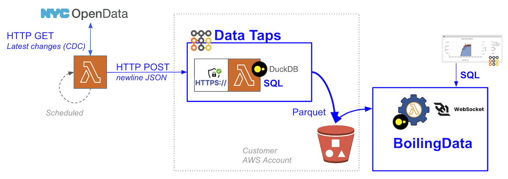

[Collect(d)ion and FluentBit](https://github.com/boilingdata/data-taps-fluentbit-example) | [Web Analytics capture](https://github.com/boilingdata/data-taps-webanalytics-example) | [PostgreSQL CDC](https://github.com/boilingdata/data-taps-postgres-cdc) | [API ingestion](https://github.com/boilingdata/data-taps-socrataOpenData-example)

# NYC OpenData API ingestion to Data Tap Example

<p align="center">
  
</p>

This example illustrates how a scheduled AWS Lambda function can fetch new data since last fetch from an API ([NYC Housing Maintenance Code Complaints and Problems](https://dev.socrata.com/foundry/data.cityofnewyork.us/ygpa-z7cr)) and feed to Data Tap for optimal S3 ingestion and analytics.

> **NOTE** The code does not (yet) fetch the new results since last fetch, but the same results.

- You need a Data Tap on your AWS Account. You can follow these instructions: https://github.com/boilingdata/data-taps-template/tree/main/aws_sam_template. Export the Tap URL as `BD_TAP_URL` environment variable.
- You need [Socrates Data API access](https://data.cityofnewyork.us/profile/edit/developer_settings). This API hosts e.g. the NYC Open Data data sets and many others.

```shell
cat .env
export BD_TAPURL=deployedDataTapUrl
export BD_USERNAME=yourBoilingUsername
export BD_PASSWORD=yourBoilingPassword
export SODA_USERNAME=socrataOpenDataAPIKeyId
export SODA_PASSWORD=socrataOpenDataSecretKey
export SODA_APPTOKEN=socrataOpenDataAppToken
```

```shell
source .env && yarn test
# The envs will be given as parameters for the stack deployment
yarn build
yarn deploy
```
