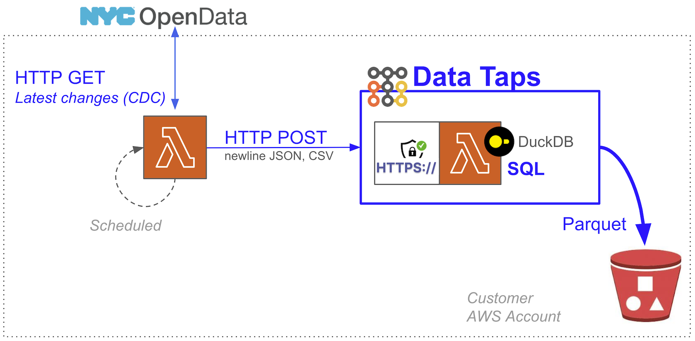

[FluentBit](https://github.com/boilingdata/data-taps-fluentbit-example) | [Web Analytics](https://github.com/boilingdata/data-taps-webanalytics-example) | [PostgreSQL CDC](https://github.com/boilingdata/data-taps-postgres-cdc) | [REST API](https://github.com/boilingdata/data-taps-nycopendata-example) | [OpenSearch/ES](https://github.com/boilingdata/data-taps-opensearch-to-s3) | [AWS Lambda Telemetry](https://github.com/dforsber/data-taps-lambda-extension)

# NYC OpenData API --> Data Tap --> S3 Parquet

<p align="center">
  
</p>

This example illustrates how a scheduled AWS Lambda function can fetch new data since last fetch from an API ([NYC Housing Maintenance Code Complaints and Problems](https://dev.socrata.com/foundry/data.cityofnewyork.us/ygpa-z7cr)) and feed to Data Tap for optimal S3 ingestion and analytics.

## Data Tap

A Data Tap is a single AWS Lambda function with [Function URL](https://docs.aws.amazon.com/lambda/latest/dg/lambda-urls.html) and customized C++ runtime embedding [DuckDB](https://www.duckdb.org/). It uses streaming SQL clause to upload the buffered HTTP POSTed newline JSON data in the Lambda to S3, hive partitioned, and as ZSTD compressed Parquet. You can tune the SQL clause your self for filtering, search, and aggregations. You can also set the thresholds when the upload to S3 happens. A Data Tap runs already very efficiently with the smallest arm64 AWS Lambda, making it the simplest, fastest, and most cost efficient solution for streaming data onto S3 in scale. You can run it on [your own AWS Account](https://github.com/boilingdata/data-taps-template) or hosted by Boiling Cloud.

You need to have [BoilingData account](https://github.com/boilingdata/boilingdata-bdcli) and use it to create a [Data Tap](https://github.com/boilingdata/data-taps-template). The account is used to [fetch authorization tokens](https://github.com/boilingdata/data-taps-template?tab=readme-ov-file#3-get-token-and-ingestion-url-and-send-data) which allow you to send data to a Data Tap (security access control). You can also share write access (see the `AUTHORIZED_USERS` AWS Lambda environment variable) to other BoilingData users if you like, efficiently creating Data Mesh architectures.

## Run

The data is fetched ordered by `received_date`, and the latest record timestamp +1ms is stored into Parameter Store on every iteration. This avoids duplicates.

- You need a Data Tap on your AWS Account. You can follow these instructions: https://github.com/boilingdata/data-taps-template/tree/main/aws_sam_template. Export the Tap URL as `BD_TAPURL` environment variable.
- You need [Socrates Data API access](https://data.cityofnewyork.us/profile/edit/developer_settings). This API hosts e.g. the NYC Open Data data sets and many others.

Create `.env` file containing your credentials like in the example below.

```shell
export BD_TAPURL=deployedDataTapUrl
export BD_USERNAME=yourBoilingUsername
export BD_PASSWORD=yourBoilingPassword
export SODA_USERNAME=socrataOpenDataAPIKeyId
export SODA_PASSWORD=socrataOpenDataSecretKey
export SODA_APPTOKEN=socrataOpenDataAppToken
```

```shell
source .env # The envs will be given as parameters for the stack deployment
yarn test
yarn build
yarn deploy
# ...
yarn destroy # delete the deployment
```
